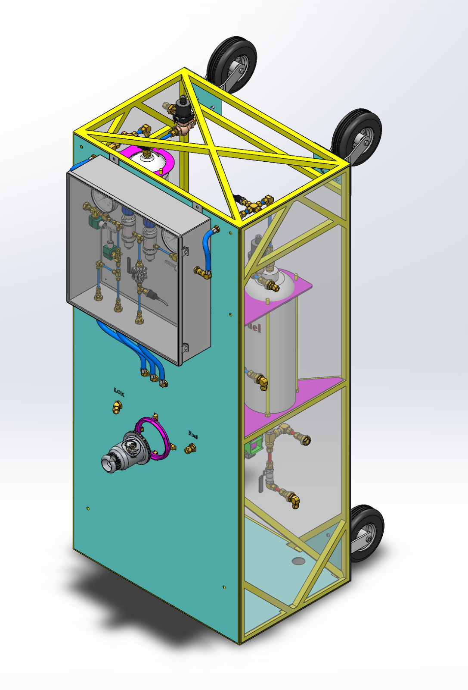

# liquid-engine-test-stand

# Liquid Fuel Engine Test Stand (LFETS) Project Overview

  PSAS team members have already designed and built a [2.5 kN regeneratively cooled bipropellant (liquid oxygen and ethanol) rocket engine](https://github.com/psas/liquid-engine-capstone-2015). This engine design included a number of innovative features including fully parametric CAD design using python scripts and SolidWorks, direct metal laser sintering (DMLS) additive manufacturing by i3D manufacturing, direct spark ignition and pintle injection. Although the rocket engine itself has already been produced, much of the overall system complexity lies in the piping, control, and data acquisition systems which support it. This project intends to flesh out these systems in order to test the engine and its successors.

  The test stand will safely test current and PSAS future generation liquid fuel engines prior to integration into a flight vehicle. PSAS will use the stand to measure engine performance, liquid fuel and oxidizer flow rates, propellant mixing capabilities and other engine performance figures of merit. These tests will be performed remotely, using automated valve switching and data acquisition systems. The LFETS system is designed to be portable by truck, and will support propulsion testing of engines up to 10 kN of thrust. The project will be open-source and will utilize live web-based Jupyter notebook design documentation.

  The feed system uses a classic regulated pressure-fed thermodynamic cycle. Gaseous nitrogen is the pressurant. The LFETS system includes a welded thrust loading truss structure, propellant and pressurant supply tanks, and feed system flow componentry. The project also includes safety and Failure Mode Effects Analysis, and procedures for safe operation and transport.
The LFETS Electrical Ground Support Equipment (EGSE) will allow for the test stand to be controlled remotely. The test stand computer controls all actuators in the LFETS system, auto-sequences engine ignition, start, shutdown, pad-safing, and contingency procedures for any test exception, as well as receiving telemetry from sensors and instrumentation. The LFETS EGSE system is derived from the 3rd generation [PSAS launch tower computer](https://github.com/psas/launch-tower), which uses a BeagleBone Black microcontroller, the [Marionette open-source DAQ](https://marionette-daq.github.io/), and a custom “SCADA-like” GUI.

###

## Project Management and administration
1. ### General
    1. Budget
    2. Bureacracy
         1. Grant compliance
         2. Progress reports
2. ### Project tracking
    1. Project status
         - updates on active sub-projects discussed at weekly meetings
3. ### Project Documentation.
    1. Project Documentation
         - [ ] S.O.P Manual
            - [ ] Technical Descriptions and Documents
            - [ ] Operational Proceedures
            - [ ] Operational handbook
            - [ ] Safety Documentation
            - [ ] Emergency Proceedures
    2. Technical Documenation
         - [ ] Project Overview
             - [X] Project description on Github
    3. Sub-projects 
         - descriptions
         - documentation
         - final report / project summary

## Mechanical Systems 
### Test stand
1. Design
   1. Specification of all needed Parts  
       Parts not yet fully specified
      - [x] Manual LOX Valves
      - [ ] LOX compatible check Valves
      - [ ] Actuator for main Fuel Valve  
           Main Fuel Valve sub-project
      - [ ] LOX Flow meter
      - [ ] Fuel Flow Meter  
           we have one, need to find spec sheet before use
      - [ ] Fuel & LOX High pressure relief valves  
           Need LOX compatable HPRV with adjustable spring
      - [ ] Pressure regulator for pnumatic LOX actuator
      - [ ] Pressure regulator for Fuel pressurant line
      - [x] Tubing for LOX and Fuel lines
   2. Piping & Instrumentation Diagram (PID)
       1. System Level PID
          - [ ] [Issue # 40](https://github.com/psas/liquid-engine-test-stand/issues/40)   
            - [ ] update System PID numbering and PID Legend
            - [x] update main fuel valve with correct symbol
            - [x] add heat exchanger to LOX igniter line
            - [x] Add pressure transducer and thermocouple  
                  location: pre-injection manafold of engine
        2. Fittings level PID
           1. [ ] Update to match CAD with pipe & fittings layout
           2. [ ] Specify all needed fittings  
                 This will be it's own project / issue
                 Create full list of all needed fittings
                 Compare against existing B.O.M. & inventory
                 Compile list of fittings yet to be purchased
        3. Drawings
            -  3D Cad model
                 - [ ] Update 3D model from System Level PID (when complete) 
        4.  Design documentation            
        5.  Finite Element Analysis (FEA)
            - [ ] [FEA Analysis and sizing of load cells](https://github.com/psas/liquid-engine-test-stand/issues/24)  
2. Purchasing / logistics
   1. Tools
      - [x] Inventory existing tools
      - [x] Specify needed tools
      - [x] purchase
   2. Parts
      - [ ] Purchase all needed parts for building the test stand
   3. Supplies & consumables
      - [ ] LOX
        - [ ] Find Vendor
        - [ ] determine safe delivery method
        - [ ] Logistics for acquisition
        - [ ] Purchase
        - [ ] acquire
      - [ ] Isopropyl alcohol (IPA)
        - [ ] [find vendor](https://github.com/psas/liquid-engine-test-stand/issues/38) 
        - [ ] determine safe delivery method
        - [ ] Logistics for acquisition
        - [ ] Purchase
        - [ ] acquire
3. Design and build - sub-projects
   - [ ] Main Fuel Valve (assigned & in progress)
   - [ ] igniter (assigned & in progress)
   - [ ] [Pressurant Diffusers](https://github.com/psas/liquid-engine-test-stand/issues/37) (assigned and in progress)
   - [ ] [Thrust Ring Adapter](https://github.com/psas/liquid-engine-test-stand/issues/36) (assigned and in progress)
   - [ ] [Cut load cell supports](https://github.com/psas/liquid-engine-test-stand/issues/32) (assigned and in progress)
   - [ ] [Weld tank upper support bars](https://github.com/psas/liquid-engine-test-stand/issues/35)
   - [ ] [Machine LOX & fuel tank brackets](https://github.com/psas/liquid-engine-test-stand/issues/34)
   - [ ] Diffuser for LOX vent - need LOX vented away from test stand
4. Misc. sub-projects 
   - [ ] [Hydro test LOX and fuel tanks](https://github.com/psas/liquid-engine-test-stand/issues/23)   
     we may not need to out source this, will need to verify we have what we need internally.
   - [ ] IPA compatable pump with sufficient head to fill Fuel tank 
5. Assembly
    - [ ] yes  
6. Testing
   - [ ] leak testing
   - [ ] cold flow testing
   - [ ] hot fire test # 1

### Test engine(s)
1. Design & Build/Machine
   1. Engine
      - [x] Engine design
      - [x] Acquire fabricated test engine(s)
   2. Pintle
      - [ ] Finalize design
   2. Purchasing / logistics
   3. Sub-projects
   4. Assembly
   5. Testing
   
## Electrical systems
1. Need additional input from ECE team before fleshing out this section

## Test Site
1. [x] Locate possible site
2. [ ] determin any regulatory / compliance issues
3. [ ] Prepare site for testing

# Helpful Links

[Link to the EGSE requirements document (LFETS Dashboard)](https://docs.google.com/document/d/1tynERJ860UtjlAusS-HwE12AD3NaDbKgZLtqMx81SuI/edit?usp=sharing)

[Link to LFETS meeting notes](https://docs.google.com/document/d/1l_8dlIdJznsHb7cQ9t38HIvYR_ec9fbx6pr6vHvQvJs/edit?usp=sharing)
